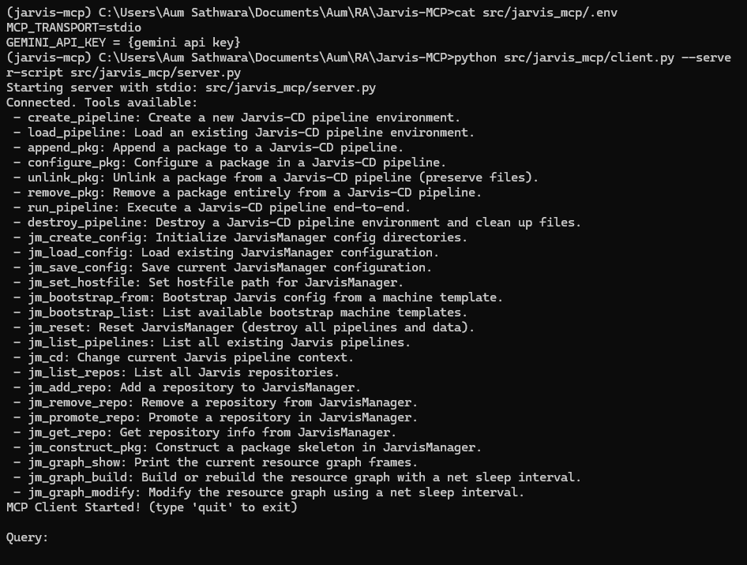
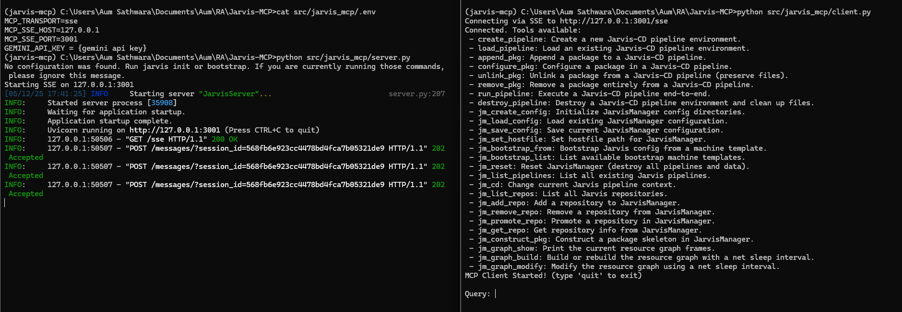
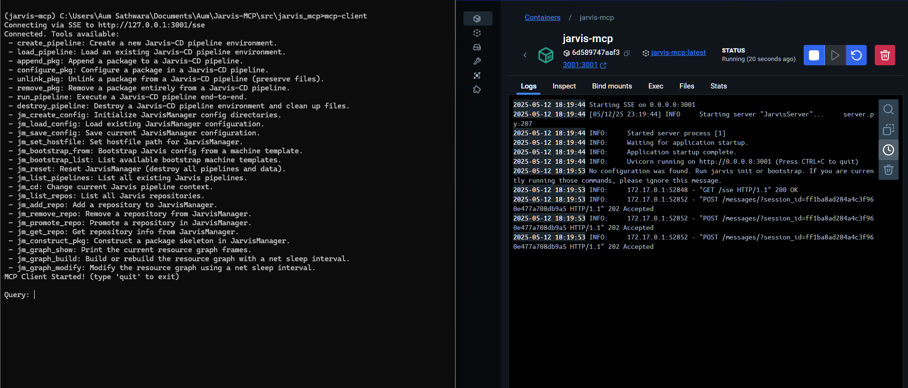

# Jarvis-MCP  
*A Model-Context-Protocol bridge for Jarvis-CD pipelines*
---

A **Gemini client + server framework** that lets you drive Jarvis-CD pipelines and Jarvis-util package through the Model Context Protocol (MCP).  
It supports both **stdio** and **SSE** transports, runs **locally or remotely**, and wraps **Jarvis-CD’s Pipeline & JarvisManager APIs** behind easy-to-call MCP “tools.”

---

## Project Structure
```
Jarvis-MCP/
├── pyproject.toml         # Project metadata / deps
├── requirements.txt       # PyPI + VCS pins
├── README.md              # ← main overview (this file)
├── DEPLOYMENT.md          # Local / remote × stdio / SSE guide
└── src/
    └── jarvis_mcp/
        ├── server.py      # FastMCP server entry-point
        ├── client.py      # LLM-driven MCP client
        └── capabilities/
            └── jarvis_handler.py  # Tools → Jarvis-CD wrappers
```

---

## Quick Installation

1. **Clone the repository**
```bash
git clone https://github.com/aumsathwara/jarvis-mcp.git
cd jarvis-mcp
```
2. **Create a virtual environment**
```bash
python -m venv .venv
source .venv/bin/activate         # Windows: .venv\Scripts\activate
```
3. **Install dependencies**
```bash
pip install --upgrade pip
pip install -r requirements.txt   # includes git-hosted jarvis-cd & jarvis-util
pip install -e .                  # editable install (adds CLI scripts)
```

You now have two commands on your **PATH**:
| Command      | Purpose                                          |
| ------------ | ------------------------------------------------ |
| `mcp-server` | Launch FastMCP server (stdio **or** SSE)         |
| `mcp-client` | Interactive CLI that lists tools & drives Gemini |

> [!NOTE]
> To run mcp-client you need to setup .env file with GEMINI_API_KEY variable or you can test mcp-server by
> ```bash
> mcp dev src/jarvis_mcp/server.py
> ```
---

## Running It 

A. **Local quick-start (stdio)**

```bash
# Terminal 1
mcp-server
# or
python src/jarvis_mcp/server.py           
```

```bash
# Terminal 2
mcp-client
# or
python src/jarvis_mcp/client.py
```
The output should look like below:



B. **Local SSE (multi-client / Inspector)**
```bash
# Terminal 1 – start server
export MCP_TRANSPORT=sse
export MCP_SSE_HOST=0.0.0.0
export MCP_SSE_PORT=3001
mcp-server               # listens on http://localhost:3001/sse
```
or create a .env file with `MCP_TRANSPORT`, `MCP_SSE_HOST`, `MCP_SSE_PORT`

```bash
# Terminal 2 – connect client
export MCP_TRANSPORT=sse
export MCP_SSE_HOST=0.0.0.1
export MCP_SSE_PORT=3001
mcp-client
```
or create a .env file with `MCP_TRANSPORT`, `MCP_SSE_HOST`, `MCP_SSE_PORT`

The output should look like below:


C. **Docker SSE**
```bash
docker build -t jarvis-mcp:latest .
docker run -d --name jarvis-mcp -p 3001:3001 jarvis-mcp:latest
```
Test stream is up:
```bash
curl -N -H "Accept: text/event-stream" http://localhost:3001/sse
```
The output should look like below:



D. **Remote stdio (SSH)**
```bash
ssh user@remote 'source ~/env/bin/activate && mcp-server'  # run server
# On local machine, attach your own stdio bridge or use SSH-stdin tunneling
```

More detailed deployment methods → [DEPLOYMENT.md](DEPLOYMENT.md).

---

## Features 🔑

| Feature                  | What you get                                                                            |
| ------------------------ | --------------------------------------------------------------------------------------- |
| **Dual transport**       | • **stdio** for zero-config local use<br>• **SSE** for multi-client & GUI/Inspector use |
| **LLM-powered client**   | Gemini 1.5 Flash Pro chooses and calls tools automatically via MCP function-calling         |
| **Pluggable tools**      | Any `@mcp.tool` instantly available in clients & the Inspector                          |
| **Docker-ready**         | Single-stage `Dockerfile` exposes SSE on **port 3001**                                  |
| **Requirements pinning** | `requirements.txt` pulls `jarvis-cd` / `jarvis-util` directly from GitHub               |

---

## How It Works ⚙️

1. **`mcp-server` startup**

   * Reads `MCP_TRANSPORT` (`stdio` | `sse`).
        * *stdio* → `mcp.run(transport="stdio")`.
        * *SSE*   → serves the FastMCP ASGI app on `/sse` with **Uvicorn**.

2. **Tool registration**

   ```python
   @mcp.tool(name="create_pipeline", description="Create …")
   async def create_pipeline_tool(...):
       …
   ```

   becomes JSON-RPC method **`create_pipeline`** with an Open-RPC schema.

3. **`mcp-client` flow**

   1. Connect via chosen transport.
   2. Fetch tool list & JSON schema.
   3. Feed them to Gemini as `function_declarations`.
   4. Parse Gemini’s `function_call`, invoke `call_tool`, print result.

4. **Jarvis-CD plumbing**

   * `Pipeline().create/append/run/destroy` etc.
   * `JarvisManager.get_instance()` for global config & resource graphs.

---

### Next Steps

* **`DEPLOYMENT.md`** → exact commands for local/remote × stdio/SSE.
* Run `mcp dev` to open the Inspector for JSON-RPC communication and debug.
